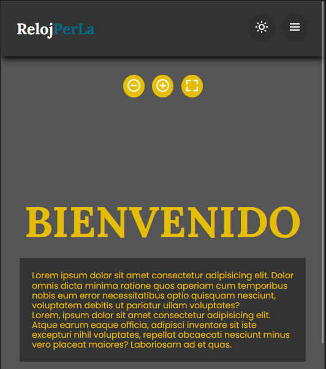

# RELOJ PerLa

En este proyecto practicare el objeto Date() con js, en el cual el usuario podrá ver la hora y fecha actual, poner una alarma que sonara cuando el tiempo ingresado se cumpla y por ultimo un cronometro.

La pagina tiene ciertos botones que pueden realizar las siguientes acciones: modo oscuro, disminuir tamaño de letra, aumentar tamaño de letra y que la pantalla sea full screen. 

_Nota: esta pagina es responsiva._

---

---

**_link para ver la pagina:_**
[RelojPerLa](yesipg.github.io/Reloj)